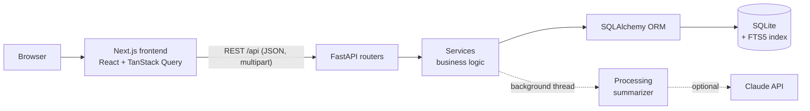
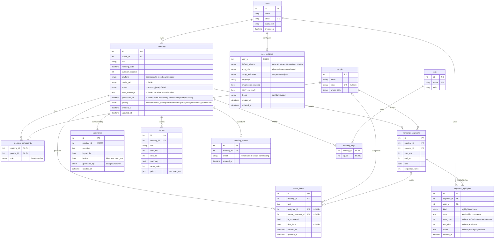

# Fireflies Clone

A Fireflies.ai-style meeting assistant. Browse a library of recorded meetings, open one to read a transcript synced to a player, and review AI-style summaries, chapters and action items. You can also create meetings from an uploaded or pasted transcript, edit and share them, and manage settings. Built as a full-stack assignment with a Next.js frontend and a FastAPI + SQLite backend.

**Live demo:** https://fireflies-clone-eta-ten.vercel.app
**API:** https://fireflies-api-doar.onrender.com/docs

> **Free-tier note:** the backend runs on Render's free plan. After ~15 minutes idle it sleeps, and the first request can take **about a minute** to wake it (the UI shows a "Waking up the demo server" banner and retries automatically). The SQLite disk is ephemeral, so **demo data resets whenever the instance restarts**.

## Contents
[Features](#features) · [Tech stack](#tech-stack) · [Architecture](#architecture-overview) · [Database](#database-schema) · [API](#api-overview) · [Local setup](#local-setup) · [Deployment](#deployment) · [Assumptions & trade-offs](#assumptions--trade-offs) · [Project structure](#project-structure)

## Features

**Core**
- **Meeting library:** week-grouped list with URL-driven search, participant, date and duration filters, sorting, pagination, bulk select and delete.
- **Tags:** colored tag badges on library rows, the Home feed and the meeting header; a multi-select "Tags" filter (any-of) kept in the URL; click a badge to filter by it.
- **Meeting detail:** transcript synced to a player (play/pause, seek, speed, skip, keyboard shortcuts, draggable progress, active-word highlighting, auto-scroll, deep links with `?t=`). Find-in-transcript and speaker/filter chips.
- **Smart Search insights:** per-speaker talk time and words per minute, transcript filters (questions, tasks, metrics, dates, pricing) and sentiment.
- **Comments and highlights:** select text in a transcript segment to highlight it, comment on it or copy it. Highlights are theme-aware, comments show a bubble with a popover, and the left rail's Comments and Bookmarks panels list them in timestamp order (click to jump and play).
- **Summary, notes and action items:** overview, keywords, timestamped bullets and chapters that seek the player; action items grouped by assignee with due dates and optimistic checkboxes; a cross-meeting Tasks view.
- **Full CRUD:** rename, edit details (participants, tags, date), delete with confirmation, editable action items (with Undo), transcript editing (per-segment edit, speaker change/reassign, Find & Replace), regenerate notes.
- **Create meetings:** upload (`.txt`, `.vtt`, `.json`), paste, or enter manually, with a live parse preview. Meetings are processed in the background with a Meeting Status page (progress steps, retry on failure, "ready" toasts).
- **Export:** download a meeting as `.txt`, `.vtt`, Markdown notes + transcript, or JSON, or print / save as PDF from a clean print view.
- **AskFred chat:** ask questions about a meeting and get Markdown answers with clickable citations that jump the player to the moment. It uses Claude when `ANTHROPIC_API_KEY` is set (falling back on any error) and a deterministic built-in engine otherwise (action items, key points, a follow-up email, what a person said, keyword search). It never answers from outside the meeting.
- **Sharing:** invite by email, remove, privacy level, Copy Link.
- **Dark mode:** light / dark / system theme, switchable from the avatar menu or Settings → Appearance, saved to your settings with no flash on load.
- **Settings:** profile, default privacy, meeting and notification preferences, autosaved. Derived notifications.
- **Global search:** a topbar dropdown (meeting titles + transcript matches, keyboard navigable) and a `/search` page with All / Meetings / Transcripts / Action items tabs, over transcripts (SQLite FTS5), titles, notes and action items. A transcript result opens the meeting at that moment with the Find box pre-filled.

**Placeholders ("Coming soon")**: integrations (connect buttons only), AI Apps, Topic Tracker, Analytics, Team, Billing/Upgrade, Playlist, soundbites, real video, email delivery, calendar auto-join.

## Tech stack

| Layer | Choice | Why |
| --- | --- | --- |
| Frontend | Next.js (App Router), React, TypeScript, Tailwind CSS, shadcn-style primitives | File-based routing, strong typing, fast iteration on a design-token based UI. |
| Data fetching | TanStack Query | Caching, optimistic updates, conditional polling and retries without hand-rolled state. |
| API types | `openapi-typescript` | TypeScript types are generated from FastAPI's OpenAPI schema, so the contract cannot drift. |
| Backend | Python 3.11+, FastAPI, Pydantic v2 | Typed request/response models, automatic OpenAPI docs and validation. |
| ORM | SQLAlchemy 2.0 (typed models) | Explicit constraints, cascades and indexes with a mature, typed API. |
| Database | SQLite (+ FTS5) | Zero setup, one file, and built-in ranked full-text search. |
| Testing | pytest (236 backend tests), Vitest (119 frontend tests) | Backend tests run against a temp DB reseeded per test; frontend tests cover pure logic and the player engine. |
| Deployment | Render (API, free) + Vercel (frontend) | Free tiers that fit a demo; config in `render.yaml`. |

## Architecture overview



**Backend layering.** Routers (`backend/app/routers`) only parse HTTP and call a service; all logic lives in `backend/app/services` (meetings, transcript parsing/intake/editing, summarizer, insights, search, sharing, settings, processing, highlights, export, AskFred). Request/response shapes are Pydantic models in `backend/app/schemas`. Domain errors are raised as `ServiceError` and mapped to a uniform `{"detail": ...}` body in one handler. Auth is a single `get_current_user` dependency, the one place to swap in real auth.

**Frontend structure.** Routes are in `src/app`; UI is split into component folders by feature (`meetings`, `meeting`, `meeting-actions`, `player`, `new-meeting`, `search`, `settings`, `sharing`, `status`, shared `ui` and `common`). Every server interaction goes through a typed client (`lib/api`) and a hook in `src/hooks`. Query keys are centralized in `hooks/queryKeys.ts` and a single invalidation map is used by the shared `useApiMutation` hook, so mutations refresh exactly the data they affect (with optimistic updates and rollback where useful).

**Player (`MediaEngine`).** The transcript player depends on a small `MediaEngine` interface (`lib/player/engine.ts`) with two implementations: a **Simulated** engine (a clock-driven timeline, used for seeded meetings, which have no audio) and an **HtmlAudio** engine (used when a meeting has a `media_url`). The engine exposes an immutable state snapshot and a subscribe function, so React reads it with `useSyncExternalStore` and re-renders only on real changes. The active segment is found by **binary search** over segment start times, so it stays cheap on long transcripts; every seek source (transcript click, summary bullet, chapter, action item, deep link) goes through the same `seekAndPlay` helper.

**Summarizer.** `services/summarizer.py` generates the overview, keywords, bullets, chapters and action items. The default is a **heuristic** generator (no API key needed). If `ANTHROPIC_API_KEY` is set, new meetings are summarised with the Claude API, and any error falls back to the heuristic path. The Claude path is covered by tests with a mocked model call only.

**AskFred.** `services/askfred.py` answers a question about one meeting. With `ANTHROPIC_API_KEY` set, Claude receives the summary, action items and a transcript whose lines are prefixed with their segment ids, must answer only from it and cite ids (`[#id]`); ids that are not in the meeting are dropped, and any error or timeout falls back to the built-in engine. The built-in engine is deterministic: intent rules for action items, key points, a follow-up email and "what did <person> say", otherwise a keyword search that quotes the best matching lines, or says it couldn't find the answer. It never invents text.

**Background processing.** Creating a meeting from a transcript saves it as `processing` and returns immediately; a background thread (`services/processing.py`) waits a simulated delay (`PROCESSING_DELAY_SECONDS`, default 4), generates the notes, then sets `ready` or `failed` with an `error_message` (retryable via `POST /api/meetings/{id}/retry`). On startup, `recover_stuck` re-queues meetings left in `processing` by a restart. The frontend polls only while something is processing.

## Database schema

SQLite via SQLAlchemy 2.0 with foreign keys enforced on every connection. The full notes are in [docs/DATABASE.md](docs/DATABASE.md).



`transcript_fts` (FTS5 virtual table, not shown) indexes `transcript_segments.text`.

| Table | Purpose and key relationships |
| --- | --- |
| `users`, `user_settings` | The (mocked) account and its 1:1 preferences row; cascade on user delete. |
| `people` | Speakers/participants, reused across meetings and separate from `users` since most never log in. |
| `meetings` | One meeting: owner, platform, `status` (`processing`/`ready`/`failed`), privacy. Everything below cascades from it. |
| `meeting_participants` | Many-to-many meetings ↔ people with a host/attendee role. |
| `transcript_segments` | Timed speaker turns. A speaker cannot be deleted from under a transcript (`RESTRICT`). |
| `summaries`, `chapters` | One summary per meeting (overview, keywords, timestamped bullets); ordered chapters with timestamped points. |
| `action_items` | Tasks per meeting. Assignee and source segment are optional and become `NULL` if deleted (`SET NULL`). |
| `meeting_shares` | Emails a meeting is shared with; unique per meeting. |
| `tags`, `meeting_tags` | Labels, many-to-many with meetings. |
| `segment_highlights` | Text-range highlights and comments on transcript segments (`kind`, `start_char`/`end_char`, `quote`, `note`). |

**Why FTS5.** Global search must scan every transcript. `LIKE '%term%'` is a full table scan with no ranking or highlighting. FTS5 gives tokenised, stemmed matching, BM25 ranking and `snippet()` excerpts. It is an external-content index (no duplicated text) kept in sync by insert/update/delete triggers, so edits and deletes are reflected automatically.

## API overview

All routes are under `/api`. Interactive docs are at `<API>/docs` (Swagger) and `/redoc`; full request/response details and examples are in [docs/API.md](docs/API.md). Errors always use `{"detail": ...}`.

| Group | Method and path | Purpose |
| --- | --- | --- |
| Meta | `GET /api/health`, `GET /api/me` | Health check, current (mocked) user |
| Settings | `GET/PATCH /api/me/settings`, `PATCH /api/me` | Preferences and profile |
| Meetings | `GET /api/meetings` | List with search, participant, tag, date, duration, status, platform filters, sort and pagination |
| | `GET/PATCH/DELETE /api/meetings/{id}` | Detail (summary, chapters, action items), edit metadata, delete |
| | `POST /api/meetings/bulk-delete` | Delete several in one transaction |
| Create | `POST /api/transcripts/parse` | Dry-run parse for the live preview |
| | `POST /api/meetings`, `POST /api/meetings/upload` | Create from JSON/pasted text or an uploaded file (processed in the background) |
| | `POST /api/meetings/{id}/transcript`, `POST /api/meetings/{id}/retry` | Attach a transcript; retry a failed meeting |
| Transcript | `GET /api/meetings/{id}/transcript` | Ordered segments, optional `?q=` matches |
| | `PATCH /api/segments/{id}` | Edit text or speaker |
| | `POST /api/meetings/{id}/transcript/replace`, `.../speakers/reassign` | Find & Replace; reassign a speaker |
| Insights | `GET /api/meetings/{id}/insights` | Talk time, WPM, filter categories, sentiment |
| | `POST /api/meetings/{id}/summary/regenerate` | Regenerate notes |
| Action items | `GET /api/action-items`, `POST /api/meetings/{id}/action-items` | List across meetings; add |
| | `PATCH/DELETE /api/action-items/{id}` | Update; delete |
| Sharing | `GET/POST /api/meetings/{id}/shares`, `DELETE .../shares/{share_id}` | List, add, remove shares |
| People & tags | `GET/POST /api/people`, `GET/POST /api/tags` | Directory with meeting stats; labels |
| Search | `GET /api/search` | Global search: transcript matches with snippets (FTS5), meeting titles, notes bullets and action items |
| Highlights | `GET/POST /api/meetings/{id}/highlights`, `DELETE /api/highlights/{id}` | List, add and delete transcript highlights and comments |
| Export | `GET /api/meetings/{id}/export?format=txt\|md\|vtt\|json` | Download a meeting as a file |
| AskFred | `POST /api/meetings/{id}/ask` | Ask a question about one meeting; answers with citations |

## Local setup

Requirements: Python 3.11+, Node.js 20.9+ (the Next.js 16 minimum).

**Backend** (port 8000)

```bash
cd backend
python3 -m venv .venv
source .venv/bin/activate
pip install -r requirements.txt
cp .env.example .env          # edit if needed
uvicorn app.main:app --reload
```

The database is created and seeded on first start (8 meetings, 13 people). To reset it by hand: `python -m app.seed.seed`. Swagger UI: http://localhost:8000/docs.

**Frontend** (port 3000)

```bash
cd frontend
npm install
echo "NEXT_PUBLIC_API_URL=http://localhost:8000" > .env.local
npm run dev
```

Open http://localhost:3000.

> **Ports and CORS:** if port 3000 is busy, `next dev` silently moves to 3001 or 3002, and the browser will then report a CORS error. `CORS_ORIGINS` in `backend/.env` is a comma-separated list (default `http://localhost:3000,http://localhost:3001`); add the port you actually use. `CORS_ORIGIN_REGEX` optionally allows a pattern (used for Vercel previews).

**Tests and checks**

```bash
cd backend && source .venv/bin/activate && pytest          # 236 tests
cd frontend && npm test                                     # 119 tests (Vitest)
cd frontend && npm run lint && npm run build
```

After changing the API, regenerate the committed types with the backend running: `cd frontend && npm run gen:api`.

Optional: set `ANTHROPIC_API_KEY` in `backend/.env` to summarise new meetings with Claude. `PROCESSING_DELAY_SECONDS=0` makes processing instant.

## Deployment

The API runs on a Render free web service (Blueprint in [render.yaml](render.yaml), single uvicorn worker, health check `/api/health`) and the frontend on Vercel (root directory `frontend`, only `NEXT_PUBLIC_API_URL` set). Step-by-step instructions and every environment variable are in [docs/DEPLOYMENT.md](docs/DEPLOYMENT.md).

## Assumptions & trade-offs

- **Mocked auth.** One default seeded user acts on every request; `get_current_user` is the single swap point for real auth.
- **Simulated playback.** Seeded and uploaded transcripts have no audio, so the player runs a clock-driven timeline. The `MediaEngine` abstraction already has an HTML audio implementation for meetings with a `media_url`.
- **Heuristic summaries.** Summaries, chapters, action items and Smart Search categories/sentiment come from regex/lexicon heuristics by default, and will sometimes misclassify. Claude is optional (for summaries and AskFred) and only tested with a mocked call; the built-in AskFred engine matches words, not meaning.
- **Privacy is stored, not enforced.** Privacy levels and shares are recorded, but with a single user nothing is gated and no invite emails are sent.
- **Ephemeral SQLite on the free tier.** Render's free disk is wiped on restart, so the DB is recreated and reseeded on boot (a file with an outdated schema is dropped and rebuilt rather than crashing). Demo data resets; this is fine for a demo, not for real data.
- **`create_all` instead of migrations.** The schema is created on startup; Alembic was skipped because the DB is seeded and disposable.
- **In-process background tasks.** Processing uses a thread inside the API process with a simulated delay, plus recovery on startup. Production would use a durable job queue (e.g. a worker with Redis) and real transcription.
- **Dates** render in the browser's timezone; stored as UTC.

**With more time:** real auth and enforced sharing permissions; real audio/video upload with speech-to-text; a job queue and Postgres with Alembic migrations; end-to-end tests (Playwright) in CI; real integrations and email.

## Project structure

```
.
├── backend/
│   ├── app/
│   │   ├── main.py            # app, CORS, lifespan (init DB, seed, recover jobs)
│   │   ├── db.py              # engine, sessions, schema bootstrap
│   │   ├── models/            # SQLAlchemy models + FTS5 setup
│   │   ├── schemas/           # Pydantic request/response models
│   │   ├── routers/           # thin HTTP layer
│   │   ├── services/          # business logic (parser, summarizer, insights, processing, ...)
│   │   └── seed/              # seeder + JSON demo data
│   ├── sample_transcripts/    # example .txt / .vtt / .json files for uploads
│   └── tests/                 # pytest suite
├── frontend/
│   └── src/
│       ├── app/               # App Router routes
│       ├── components/        # feature folders + ui primitives
│       ├── hooks/             # TanStack Query hooks, query keys
│       └── lib/               # API client + generated types, player engines, utilities
├── docs/                      # API.md, DATABASE.md, DEPLOYMENT.md
├── render.yaml                # Render Blueprint
├── PROGRESS.md                # build log and decisions
└── CLAUDE.md                  # project conventions
```
