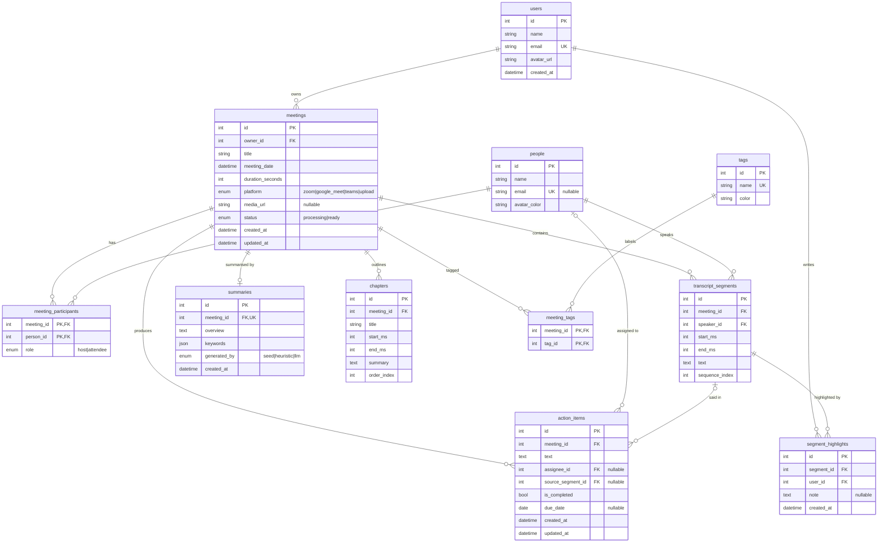

# Database

SQLite, accessed through SQLAlchemy 2.0 typed models (`backend/app/models/`). Foreign keys are enforced
(`PRAGMA foreign_keys=ON` on every connection, see `backend/app/db.py`). Tables are created on startup by
`init_db()`, then demo data is seeded if the database is empty.

## ER diagram



`transcript_fts` (FTS5 virtual table, not shown) indexes `transcript_segments.text`; see [Search](#search).

## Tables

| Table | Purpose | Notes |
| --- | --- | --- |
| `users` | App accounts. Auth is mocked, so one default user is seeded. | `email` unique. |
| `people` | Participants/speakers, reused across meetings (separate from `users`, since most speakers never log in). | `email` unique, nullable. |
| `meetings` | One recorded meeting. | Index `(owner_id, meeting_date)` for the dashboard list; index on `status`; `duration_seconds >= 0` check. |
| `meeting_participants` | Many-to-many `meetings` ↔ `people` with a `role`. | Composite PK `(meeting_id, person_id)`; index on `person_id` for the reverse lookup. |
| `transcript_segments` | One speaker turn with `start_ms`/`end_ms`. | Index `(meeting_id, start_ms)` serves ordered reads and "segment at time t"; unique `(meeting_id, sequence_index)`; `end_ms >= start_ms` check. |
| `summaries` | AI-style overview + keyword list. | One-to-one with `meetings` via unique FK. `generated_by` distinguishes seeded from LLM output. |
| `chapters` | Topic outline with a time range. | Unique `(meeting_id, order_index)`. |
| `action_items` | Tasks from a meeting. | Optional assignee and optional link to the segment where it was said. Indexes on `(meeting_id, is_completed)` and `assignee_id`. |
| `tags` / `meeting_tags` | Labels, many-to-many with meetings. | `tags.name` unique; composite PK on the link table. |
| `segment_highlights` | A user's highlight/comment on a segment (bonus feature). | Indexed on `segment_id` and `user_id`. |

## Delete behaviour

| Relationship | `ON DELETE` | Why |
| --- | --- | --- |
| everything hanging off `meetings` (participants, segments, summary, chapters, action items, meeting tags) | `CASCADE` | A meeting owns its content. |
| `segment_highlights.segment_id` / `.user_id` | `CASCADE` | Highlights are meaningless without either side. |
| `meetings.owner_id` | `CASCADE` | Deleting a user removes their meetings. |
| `action_items.assignee_id`, `action_items.source_segment_id` | `SET NULL` | The task survives losing its assignee or source moment. |
| `transcript_segments.speaker_id` | `RESTRICT` | A person who spoke in a transcript can't be deleted from under it. |

Relationships also set `passive_deletes=True`, so the database performs cascades rather than loading children.

## Search

`transcript_fts` is an FTS5 external-content table (`porter unicode61` tokenizer) over `transcript_segments.text`,
kept in sync by `AFTER INSERT/DELETE/UPDATE` triggers (`backend/app/models/fts.py`). Query it by joining on
`rowid = transcript_segments.id`, e.g.:

```sql
SELECT s.meeting_id, s.start_ms, snippet(transcript_fts, 0, '<mark>', '</mark>', '…', 12)
FROM transcript_fts JOIN transcript_segments s ON s.id = transcript_fts.rowid
WHERE transcript_fts MATCH 'runway' ORDER BY rank;
```

## Seed data

`python -m app.seed.seed` (from `backend/`) drops and recreates everything: 1 user, 13 people, 10 tags, 8 meetings.
Meeting lengths vary: a meeting may set `target_minutes`, which rescales its computed timeline (so the seed has meetings under 15, 15-30 and over 30 minutes for the duration filter). Content is JSON in `backend/app/seed/data/` (`people.json`, `meetings/*.json`). Timestamps are computed from
text length, so segments never overlap and chapters/action items line up with the transcript.
